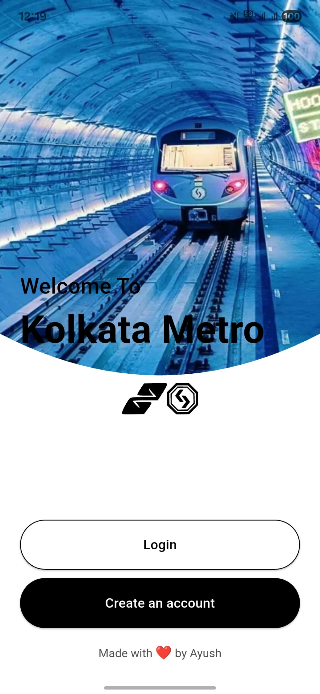
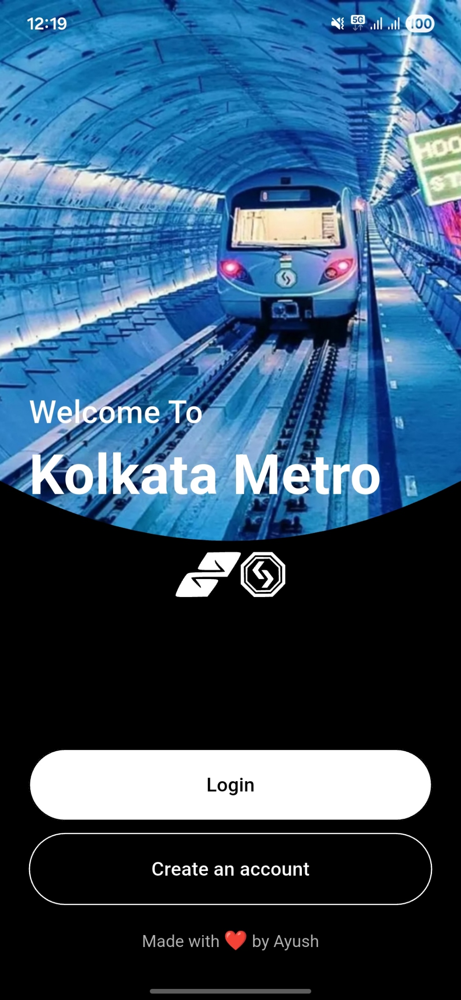
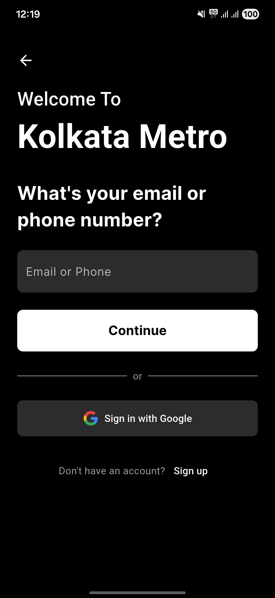
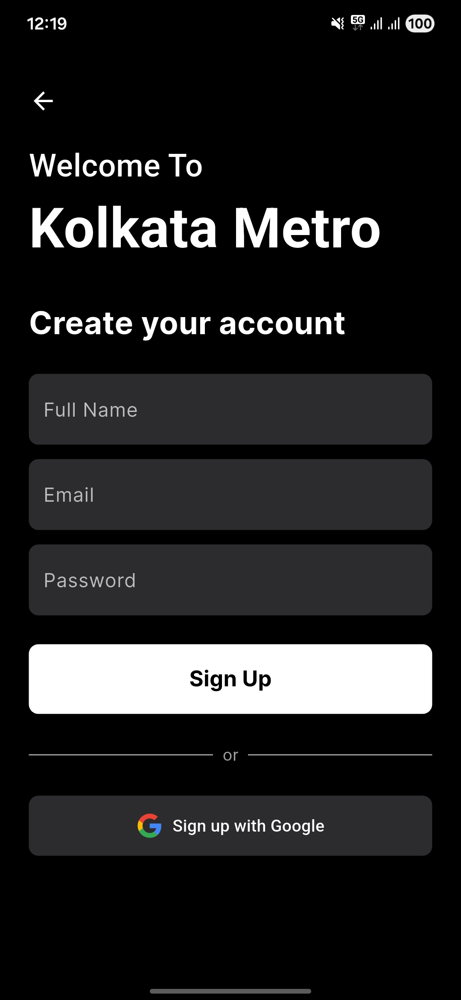

# KolkataMetro App

A Flutter application for navigating the Kolkata Metro system, built with Google Maps, Firebase, and Provider.

**[Live Demo](https://retr0hub.github.io/MetroKolkata/)** 👈

## 🌟 Features

- View the metro map using Google Maps.
- User authentication with Google Sign-In via Firebase.
- Real-time data synchronization with Cloud Firestore.
- State management using Provider.

## 📸 Screenshots

<table align="center">
  <tr>
    <td align="center" valign="top"></td>
    <td align="center" valign="top"></td>
    <td align="center" valign="top"></td>
  </tr>
  <tr>
    <td align="center" valign="top"></td>
    <td align="center" valign="top"></td>
    <td align="center" valign="top"></td>
  </tr>
</table>

## ⚙️ Setup and Installation

To get a local copy up and running, follow these simple steps.

### Prerequisites

- Flutter SDK: Make sure you have the Flutter SDK installed. You can find instructions [here](https://flutter.dev/docs/get-started/install).
- An editor like VS Code or Android Studio.

### Installation

1.  **Clone the repo**
    ```sh
    git clone https://github.com/retr0hub/MetroKolkata.git
    cd MetroKolkata
    ```

2.  **Install dependencies**
    ```sh
    flutter pub get
    ```

3.  **Configure API Keys**

    This project requires a Google Maps API key to function.

    a. In the `android/` directory, create a copy of the example properties file. Rename `keys.properties.example` to `keys.properties`.

    b. Open the new `android/keys.properties` file and replace the placeholder with your actual Google Maps API key.
    ```properties
    MAPS_API_KEY=YOUR_GOOGLE_MAPS_API_KEY_HERE
    ```
    > **Note:** Ensure you have enabled the "Maps SDK for Android" in your Google Cloud Platform project for this key.

4.  **Run the app**
    ```sh
    flutter run
    ```

## 🤝 Contributing

Contributions are what make the open-source community such an amazing place to learn, inspire, and create. Any contributions you make are **greatly appreciated**. Please fork the repo and create a pull request.

## 📜 License

Distributed under the MIT License. See `LICENSE.md` for more information. (You'll need to add a LICENSE file).